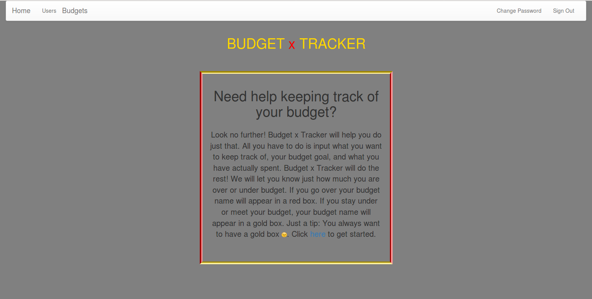

# About this app

This app is called "Budget Tracker" and it allows users to track their budget by inputting their goal budget and what they actually spent. The "Budget-Tracker" then calculates the difference and tells the user if they are over or under budget. There are two columns on the "budgets" route and if the user is over budget, the budget name goes into the "thumbs up" column and if not, it goes into the "thumbs down" column. I made the background the color of money. It's called "dollar bill".

[Link to deployed site](https://deejay94.github.io/budget/)

[Link to back-end repo](https://github.com/deejay94/budget-api)

[Back-end deployed site](https://budget1-api.herokuapp.com/)

## Technology used
Ember
Handlebars
Javascript
Ruby on Rails
CSS

## Development Process
[Link to Wireframe](https://imgur.com/a/hSoJJ)

[Link to ERD](https://imgur.com/a/Te5sp)

[Link to schedule](https://imgur.com/a/G6D6h)

My first step was to create the ERD. Then, I made the wireframe. When I had a good idea of what I wanted to do, I made a schedule. I wrote down everything I wanted to complete on Day 1. As I finished the tasks, I checked them off. I did the same thing with Day 2. By Day 2, I was finished with version 1 of my project. I decided to do my version 2, which was adding the "actual" attribute. I created a branch for each feature that I worked on and worked on committing often. I used the notes I took in class to help me with each step. I also opened up issues and asked my classmates if I had any problems. I wanted to do Ember to challenge myself. I'm glad that I took on the challenge.

## User Stories
-As a user, I would like to create a budget.
-As a user, I would like to make a list of the things I want to keep track of.
-As a user, I want to be able to edit and delete my lists.

## Unsolved Problems

I want to make it look a lot more appealing to the eye.
